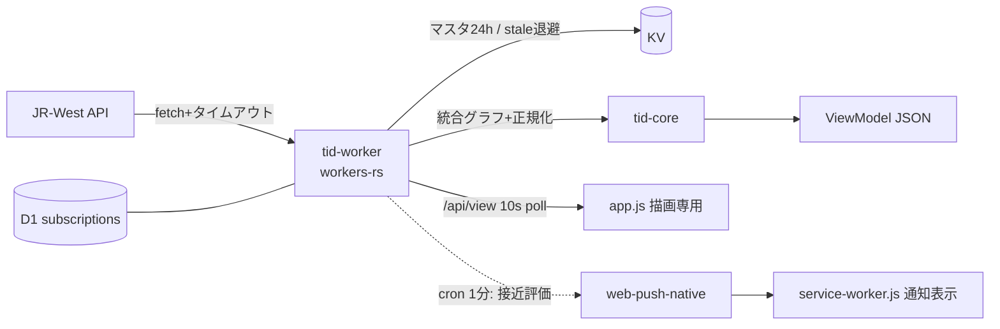

# ver6 — Cloudflare Workers 移行計画

ver1(茨木駅専用ビュー)を Cloudflare Workers へ移植する。方針は確定済み。本書は実装の作業台紙。

## 目的と基本方針

- クライアントは**表示だけ**に痩せさせる(取得・駅処理・統合はすべて Worker 側)。
- Worker は **全部 Rust(workers-rs)**。ドメインロジックは CF 非依存の `tid-core` クレートに分離し `cargo test` で担保。
- 有料プラン前提(CPU 制約は考慮不要)。キャッシュは鮮度と上流保護のためだけに置く。
- 既存ユーザーの localStorage 設定(`tid:v1:settings`)はスキーマ不変で引き継ぐ。

## 確定事項

| 項目 | 決定 | 根拠 |
|---|---|---|
| Worker 言語 | workers-rs(Rust→wasm32) | 公式サポート、`scheduled`/D1/KV バインディングあり |
| Web Push | `web-push-native` 0.5.0 | **ローカル検証済み**: wasm32 ビルド通過、VAPID+aes128gcm Request 組立て、ECE 往復テスト成功 |
| wasm 実行時対応 | `getrandom` 0.2 `[js]` + 0.4 `[wasm_js]` を有効化 / 時刻は coarsetime が `Date.now()` を使用 | 検証済み。追加コード不要 |
| 背景通知 | Cron Trigger(最短1分)→ 接近評価 → Push送信 | フォアグラウンド音声はクライアント10秒ポーリングで即時性維持 |
| 購読保存 | D1(`subscriptions` テーブル) | 重複抑制(last_notified_key + 3分窓)を兼ねる |
| 上流キャッシュ | KV: 駅マスタ24h + stale-if-error スナップショット。走行位置は隔離内メモリ数秒キャッシュ | KV 最小TTL60s のため高頻度データはメモリキャッシュ+失敗時KVフォールバック |
| modern/legacy 二重配信 | 維持(esbuild IIFE 再生成のみ) | 既存要件 |

## 対象リポジトリ構成(移行後)

```
crates/
  tid-core/        # 純Rust: model / master / category / merge / view / alarm
    tests/fixtures/  # 実APIスナップショット(ゴールデン)
  tid-worker/      # workers-rs glue: routes / upstream / push / cron
public/            # デプロイ対象: index.html, assets/{css,img,sound}, components/,
                   #   assets/js/app.js(新), components.js, tid-settings.js,
                   #   tid-background.js, pwa.js, runtime-loader.js, service-worker.js, manifest
old/               # アーカイブ(デプロイ対象外、リポジトリにのみ残置)
migrations/0001_subscriptions.sql
wrangler.jsonc / .dev.vars(ローカル用VAPID鍵)
dev_proxy.py       # 廃止(Phase 5)
```

旧 `tid.js` / `tid-data.js` / `tid-category.js` / `tid-render.js` / `tid-rules.js` / `tid-alarm.js` / `main.js` / `area.js` は old フロー専用として撤去しないが、新ページから参照しない。

## API 契約

### GET /api/view?station=茨木

```jsonc
{
  "serverTime": "2026-08-23T12:34:56+09:00",
  "station": { "code": "...", "name": "茨木" },
  "up": [ /* Train[] 近接順 */ ],
  "down": [],
  "traffic": {
    "lines":   [ { "lineId": "kyoto", "status": "平常", "detail": "..." } ],
    "express": []
  }
}
// Train:
{
  "no": "3370M", "dir": 1,
  "displayType": "新快速",        // 「うX快○」展開後
  "nickname": "", "destText": "京都",
  "cars": 10, "delayMinutes": 0,
  "posLabel": "茨木～高槻",       // サーバ側で名前解決済み
  "stopped": false,
  "hopsFromStation": -1,          // 選択駅基準の正規化ホップ
  "category": 2, "categoryLabel": "快速", "colorClass": "type-orange",
  "willStopHere": true,           // category ∈ 選択駅の停車種別
  "atStation": false              // 選択駅に停車中 or 隣接区間から進入中(現行 boundaryMatch 相当)
}
```

### その他

- `GET /api/stations?scope=<lineScope>` — 選択駅基準順の統合駅リスト(駅フィルタ用)
- `POST /api/push/subscriptions` `{ subscription, station, prefs }` / `DELETE`(endpointハッシュ)
- `/api/v3/*` 生パススルーと `/old/*` はデプロイ対象外(clean cut-over)

## データフロー



## 作業フェーズ

### Phase 0 — 準備
- [ ] 実APIフィクスチャ収集: `kinki_master.json` / 6路線 `_all.json` / 6路線 `.json` / `kinki.json`(traffic)
- [ ] 移植対象の精読: `buildMergedIndexesForLines`, `buildGraphMetrics`, `mergeTrainPayloads`, `getDestText`, `enhanceTrain`, カテゴリ判定, アラーム発火条件(**未コミット修正: 判定基準を選択駅の停車種別へ変更済み** — これを正とする)

### Phase 1 — tid-core
- [ ] `model.rs` 型定義 / `master.rs` 上流JSONパース(寛容: 未知フィールド無視)
- [ ] `category.rs`: CATEGORY_MATCHERS, `U_TOKEN_TYPE_MAP`(うれしート), `color.txt` 解析
- [ ] `merge.rs`: 複数路線隣接グラフ統合 + 選択駅基準ホップ正規化 ← **最大リスク箇所**
- [ ] `view.rs` ViewModel 組立 / `alarm.rs` 接近判定(ver1の最新挙動を移植)
- [ ] golden テスト: 同一入力→現行JS出力と同一結果

### Phase 2 — tid-worker
- [ ] routes(`/api/view`, `/api/stations`, `/api/push/subscriptions`) + 静的配信(ASSETS binding フォールバック)
- [ ] upstream fetch + メモリキャッシュ + KV stale-if-error
- [ ] scheduled: 購読グループ化 → tid-core 評価 → web-push-native 送信 → D1 重複管理(404/410 で購読削除)
- [ ] wrangler.jsonc(assets/D1/KV/cron/vars/secrets) + migrations + .dev.vars(VAPID鍵生成)

### Phase 3 — クライアント
- [ ] `app.js`: ポーリング→描画(テーブル/運行情報)、設定UI、アラーム音声キュー(atStation/willStopHere × ローカルprefs)、3分重複抑制
- [ ] 流用: components.js / tid-settings.js / tid-background.js / pwa.js / service-worker.js(無変更)
- [ ] index.html は meta(push:publicKey 等)整備、runtime-loader に `app` エントリ追加
- [ ] legacy バンドル再生成(build-legacy.ps1)

### Phase 4 — 検証
- [ ] `cargo test`(tid-core golden / tid-worker 単体)+ wasm32 ビルド
- [ ] `wrangler dev`: /api/view 200 & JSON 正常性、静的配信、Push 購読 API
- [ ] ブラウザ実画面確認(desktop/mobile): 列車一覧、駅フィルタ、アラーム音声解除フロー

### Phase 5 — 切替と片付け
- [ ] dev_proxy.py 削除、README/AGENTS.md 更新、legacy 再生成コミット
- [ ] ver1 との差分レビュー、origin/ver6 push

## リスク管理

| リスク | 状態 |
|---|---|
| Web Push 暗号の wasm32 対応 | **解消済み**(web-push-native 実証検験完了) |
| merge 正規化の移植精度 | golden テストで担保(実APIフィクスチャ×時間帯複数) |
| 上流出力形式の無保証変更 | 寛容パース + KV 直前正常値を stale 返し |
| 背景通知の遅延(最大~2分) | 受容(プラットフォーム制約)。フォアグラウンドは影響なし |

## コミット方針

Conventional Commits。機能単位で Phase ごとに分割。`git add -A` 禁止(ユーザーの未コミット変更を巻き込まない)。
